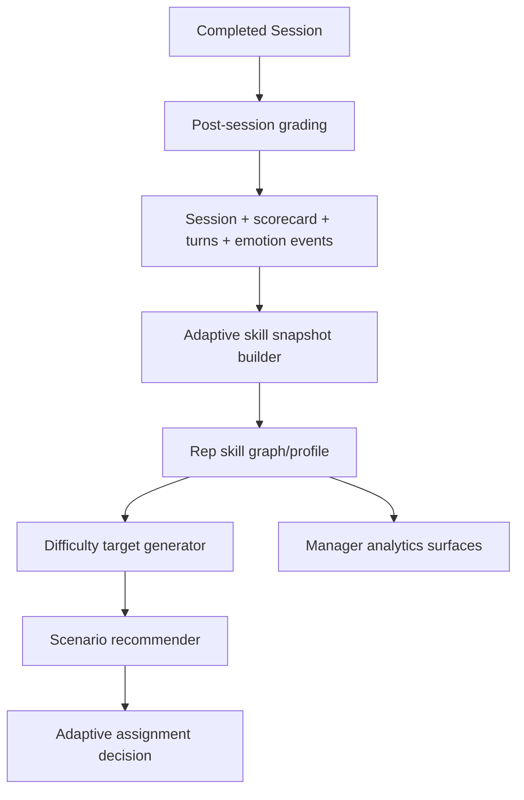

# Adaptive Training Engine

Repository snapshot analyzed on March 6, 2026.

## Purpose

DoorDrill already has the beginnings of an adaptive training loop in [backend/app/services/adaptive_training_service.py](/Users/calelamb/Desktop/personal%20projects/doordrill/backend/app/services/adaptive_training_service.py) and manager endpoints in [backend/app/api/manager.py](/Users/calelamb/Desktop/personal%20projects/doordrill/backend/app/api/manager.py). Phase 7 should turn that into a first-class system that:

- tracks rep skill progression across sessions
- adjusts future scenario difficulty without oscillating wildly
- recommends scenarios that target the rep's weakest skills
- gives managers visibility into readiness, growth velocity, and challenge calibration

The core design principle is simple: adapt challenge based on demonstrated skill, but keep the rep inside a productive difficulty band rather than maximizing hardness.

## Current Implementation Baseline

The current backend already computes an adaptive plan on demand:

- `GET /manager/reps/{rep_id}/adaptive-plan`
- `POST /manager/reps/{rep_id}/adaptive-assignment`

Today the engine derives a profile from:

- scorecard category scores in [backend/app/models/scorecard.py](/Users/calelamb/Desktop/personal%20projects/doordrill/backend/app/models/scorecard.py)
- transcript objection tags and turns in [backend/app/models/session.py](/Users/calelamb/Desktop/personal%20projects/doordrill/backend/app/models/session.py)
- emotion transitions emitted by [backend/app/services/conversation_orchestrator.py](/Users/calelamb/Desktop/personal%20projects/doordrill/backend/app/services/conversation_orchestrator.py)
- scenario metadata in [backend/app/models/scenario.py](/Users/calelamb/Desktop/personal%20projects/doordrill/backend/app/models/scenario.py)

The current engine is useful, but it still has two structural limitations:

1. adaptive state is computed at request time instead of persisted as first-class history
2. adaptive decisions are stored inside `Assignment.retry_policy.adaptive_training` instead of dedicated tables

Phase 7 should preserve the current API behavior while adding durable adaptive data models and analytics outputs.

## System Flow



## Skill Tracking Model

### Skill Nodes

The active skill graph in [backend/app/services/adaptive_training_service.py](/Users/calelamb/Desktop/personal%20projects/doordrill/backend/app/services/adaptive_training_service.py) uses five nodes:

- `opening`
- `rapport`
- `pitch_clarity`
- `objection_handling`
- `closing`

This is the right backbone for Phase 7. Keep it as the primary graph because it maps cleanly to DoorDrill's scoring categories and coaching workflows.

### Skill Edges

The current propagation edges are directionally correct and should remain the default graph:

- `opening -> rapport` with weight `0.35`
- `rapport -> pitch_clarity` with weight `0.20`
- `pitch_clarity -> objection_handling` with weight `0.30`
- `objection_handling -> closing` with weight `0.35`
- `rapport -> closing` with weight `0.15`

These edges let DoorDrill avoid a naive "five isolated scores" model. A rep who improves opening quality and rapport should see some downstream lift, but not enough to mask a weak close.

### Session-Level Skill Snapshot

Each graded session should produce a normalized snapshot on a `0-10` scale.

Current derived inputs already exist:

- `opening` from scorecard category score
- `pitch_clarity` from `pitch_delivery`
- `objection_handling` from scorecard plus objection load
- `closing` from `closing_technique`
- `rapport` from opening, professionalism, and emotion recovery
- `emotion_recovery` from first/last homeowner emotion state
- `objection_load` from transcript objection tags
- `scenario_difficulty` from `Scenario.difficulty`

Current formulas are roughly:

```text
rapport = 0.35*opening + 0.35*professionalism + 0.30*emotion_recovery
pitch_clarity = 0.80*pitch + 0.10*opening + 0.10*professionalism
objection_handling = 0.75*objections + 0.15*emotion_recovery + 0.20*objection_load + challenge_bonus
closing = 0.75*closing + 0.10*pitch + 0.15*emotion_recovery + 0.50*challenge_bonus
```

That model is good enough to keep, with two safeguards:

- cap `objection_load` influence so raw tag count cannot inflate the score beyond actual quality
- preserve `challenge_bonus`, because success in a harder scenario should count more than success in an easy one

### Aggregated Rep Skill Profile

The rep profile should be built from recent session snapshots using recency weighting plus graph propagation:

```text
direct_skill_score = weighted_mean(session_skill_scores, recent_sessions_weighted_more)
propagated_skill_score = direct_score + upstream_graph_influence
confidence = min(1.0, graded_session_count / 4)
trend = recent_half_average - prior_half_average
```

The existing service already implements this pattern. Phase 7 should formalize the output as:

| Field | Meaning |
| --- | --- |
| `score` | current normalized skill level on `0-10` |
| `trend` | recent movement, positive or negative |
| `confidence` | reliability of the estimate based on sample depth |
| `contributing_metrics` | scorecard/session metrics used to compute the node |
| `last_updated_at` | most recent graded session contributing to the node |

### Example Profile

```text
opening: 8.1
rapport: 7.2
pitch_clarity: 6.5
objection_handling: 5.0
closing: 4.3
```

This profile implies the rep can start conversations well, but the engine should assign scenarios that force cleaner objection resolution and stronger closes before it raises overall difficulty aggressively.

### Recommended Persistence Additions

Add durable adaptive tables instead of recomputing everything from raw history on every request:

| Table | Purpose |
| --- | --- |
| `rep_skill_snapshots` | one row per graded session per skill node |
| `rep_skill_profiles` | latest rolled-up skill state per rep |
| `adaptive_assignment_decisions` | why a scenario was recommended or auto-assigned |
| `scenario_difficulty_profiles` | normalized factor breakdown for each scenario |

Suggested shapes:

#### `rep_skill_snapshots`

- `id`
- `rep_id`
- `session_id`
- `scenario_id`
- `skill_key`
- `raw_score`
- `adjusted_score`
- `trend_delta`
- `confidence`
- `inputs_json`
- `created_at`

#### `rep_skill_profiles`

- `rep_id`
- `readiness_score`
- `recommended_difficulty`
- `weakest_skills_json`
- `skill_profile_json`
- `skill_graph_version`
- `updated_at`

#### `adaptive_assignment_decisions`

- `id`
- `rep_id`
- `assignment_id`
- `scenario_id`
- `recommended_difficulty`
- `target_difficulty_factors_json`
- `selected_scenario_score`
- `weakest_skills_json`
- `decision_source`
- `created_at`

#### `scenario_difficulty_profiles`

- `scenario_id`
- `difficulty`
- `objection_frequency`
- `homeowner_resistance_level`
- `patience_window_score`
- `scenario_complexity`
- `focus_skills_json`
- `updated_at`

## Difficulty Adjustment Algorithm

### Inputs

Difficulty should be set from a mix of readiness, recent trend, and weakest-skill floor.

The current engine already computes:

- average readiness across skills
- weakest skill score
- performance trend from recent sessions
- target difficulty factors:
  - `objection_frequency`
  - `homeowner_resistance_level`
  - `patience_window`
  - `scenario_complexity`

### Recommended Difficulty

The current service logic is directionally right:

```text
readiness = mean(skill scores)
weakest = min(skill scores)
base_difficulty = 1 + floor(max(0, readiness - 5.0) / 1.1)
if performance_trend > 0.35 and readiness >= 6.5: +1
if weakest < 5.2: -1
recommended_difficulty = clamp(base_difficulty, 1, 5)
```

Keep this structure, because it does three important things:

- rewards broad competence
- prevents a single hot streak from over-promoting the rep
- blocks difficulty escalation when one core skill is still underdeveloped

### Factor-Level Difficulty Targets

Difficulty in DoorDrill should not just mean a bigger integer. It should map to runtime behaviors the simulator actually uses.

The existing factor model should remain the source of truth:

- `objection_frequency`: how many concerns surface and how often new objections stack
- `homeowner_resistance_level`: how skeptical, busy, annoyed, or hostile the persona starts
- `patience_window`: how quickly the homeowner disengages or punishes weak pacing
- `scenario_complexity`: number of stages, concern stack depth, and pathing complexity

Current target generation is sensible:

- if `objection_handling` is weak, raise `objection_frequency`
- if `opening` or `rapport` is weak, raise `homeowner_resistance_level` and shorten `patience_window`
- if `closing` is weak, raise `scenario_complexity`

This is the key idea for Phase 7: difficulty should be targeted, not uniform.

### Runtime Link To The Simulator

These recommendations already line up with live conversation behavior in [backend/app/services/conversation_orchestrator.py](/Users/calelamb/Desktop/personal%20projects/doordrill/backend/app/services/conversation_orchestrator.py):

- higher scenario difficulty hardens starting emotion
- difficulty `4-5` increases pressure and punishments for weak close attempts
- seeded objections and persona attitude affect active objections and objection pressure
- high-difficulty scenarios trigger stronger backfire behavior when the rep pushes too early

That means the adaptive system does not need a second simulator. It needs to choose scenarios whose metadata drives the runtime in the desired direction.

### Scenario Recommendation Score

Scenario ranking should continue to combine two forces:

```text
weakness_alignment = weighted match between scenario focus skills and rep weak skills
difficulty_fit = closeness between scenario factors and target factors
recommendation_score = clamp(0.75*weakness_alignment + 0.65*difficulty_fit, 0, 10)
```

The current service already does this. Phase 7 should make it durable and explainable by storing:

- top focus skills
- targeted weaknesses
- factor deltas versus target
- final recommendation score
- human-readable rationale

### Safety Rails

To avoid unstable difficulty jumps:

- never increase more than `+1` difficulty band off the rep's previous assigned band
- require at least `2` graded sessions before increasing above difficulty `2`
- require positive trend plus weakest-skill floor before assigning difficulty `4-5`
- reduce difficulty after `2` consecutive regressions or repeated failure on the same skill cluster

## Integration With Scenario Assignment

### Assignment Entry Points

Adaptive assignment should remain accessible from manager workflows, but the engine should also be callable automatically after grading.

Current manual entry points:

- [backend/app/api/manager.py](/Users/calelamb/Desktop/personal%20projects/doordrill/backend/app/api/manager.py) `GET /manager/reps/{rep_id}/adaptive-plan`
- [backend/app/api/manager.py](/Users/calelamb/Desktop/personal%20projects/doordrill/backend/app/api/manager.py) `POST /manager/reps/{rep_id}/adaptive-assignment`

### Post-Session Integration

Recommended production flow:

1. session is graded
2. analytics refresh rebuilds `AnalyticsFactSession`
3. adaptive snapshot job computes or updates `rep_skill_snapshots`
4. rep profile is rolled up into `rep_skill_profiles`
5. optional follow-up recommendation or assignment decision is generated

The natural hook is immediately after grading in the post-session pipeline:

- [backend/app/services/session_postprocess_service.py](/Users/calelamb/Desktop/personal%20projects/doordrill/backend/app/services/session_postprocess_service.py)
- [backend/app/tasks/post_session_tasks.py](/Users/calelamb/Desktop/personal%20projects/doordrill/backend/app/tasks/post_session_tasks.py)

Add an `adaptive.refresh_rep` task so skill updates happen asynchronously and do not block websocket teardown or grading.

### Scenario Selection Rules

When creating the next assignment:

1. load the persisted rep skill profile
2. compute target difficulty factors
3. load scenario difficulty profiles for the org
4. rank scenarios by recommendation score
5. filter out recently repeated scenarios unless deliberate spaced repetition is requested
6. create the assignment and persist the decision row

Use spaced repetition intentionally:

- repeat the same scenario family when a rep is fixing a single weak skill
- broaden scenario variety once the weakest skill rises above threshold

### Assignment Payload Strategy

Short-term, keep writing adaptive metadata into `Assignment.retry_policy.adaptive_training` for backward compatibility.

Long-term, make `adaptive_assignment_decisions` the source of truth and keep `retry_policy` as a lightweight execution policy field only.

## Manager Analytics Possibilities

DoorDrill already has strong analytics infrastructure in:

- [backend/app/models/analytics.py](/Users/calelamb/Desktop/personal%20projects/doordrill/backend/app/models/analytics.py)
- [backend/app/services/analytics_refresh_service.py](/Users/calelamb/Desktop/personal%20projects/doordrill/backend/app/services/analytics_refresh_service.py)
- [backend/app/services/management_analytics_service.py](/Users/calelamb/Desktop/personal%20projects/doordrill/backend/app/services/management_analytics_service.py)

Phase 7 should add adaptive views on top of those facts rather than building a parallel analytics stack.

### Recommended Manager Views

- `Skill graph by rep`
  - current node scores, trend arrows, and confidence
- `Readiness ladder`
  - reps ordered by readiness score and current recommended difficulty
- `Difficulty calibration`
  - assigned difficulty versus achieved score and pass rate
- `Weakness cluster heatmap`
  - team-wide concentration of low `opening`, `rapport`, `pitch_clarity`, `objection_handling`, and `closing`
- `Scenario effectiveness by skill`
  - which scenarios most reliably improve a given weak skill after follow-up attempts
- `Coaching impact`
  - skill delta before and after coaching notes or score overrides
- `Under-challenged / over-challenged alerts`
  - reps cruising through easy drills or repeatedly failing above their band

### Useful Derived Metrics

Add adaptive metrics to the analytics layer:

| Metric | Meaning |
| --- | --- |
| `readiness_score` | mean of current propagated skill scores |
| `skill_velocity_opening` ... `skill_velocity_closing` | recent slope by skill |
| `challenge_gap` | assigned difficulty minus recommended difficulty |
| `difficulty_success_rate` | pass rate by assigned difficulty band |
| `recovery_rate` | frequency of emotion improvement within high-resistance sessions |
| `weak_skill_repeat_count` | consecutive assignments targeting the same weak node |
| `scenario_lift_by_skill` | average improvement after scenarios focused on a skill |

### Alerting Opportunities

Examples:

- rep readiness increasing, but closing remains flat for `5+` sessions
- high objection difficulty assigned to reps with falling rapport trend
- scenario pass rate collapsing for a difficulty band, suggesting poor calibration or a broken scenario
- coaching notes repeatedly tagging the same weakness with no subsequent skill lift

## Recommended Implementation Shape

### Phase 7 Scope

1. keep the current adaptive service and endpoints
2. add first-class adaptive persistence tables
3. move profile generation to async post-grade refresh
4. cache or persist scenario difficulty profiles
5. expose adaptive metrics through manager analytics endpoints

### Minimal Code Changes

- extend analytics refresh or post-session tasks with adaptive refresh work
- persist per-session skill snapshots after grading
- persist per-rep rolled-up skill profiles
- persist assignment recommendation decisions
- add manager analytics response fields for readiness, skill deltas, and calibration

### What Not To Do

- do not hardcode scenario recommendations in the dashboard
- do not treat `Scenario.difficulty` alone as the full challenge model
- do not let a single score spike move a rep multiple difficulty bands
- do not create a separate adaptive scoring rubric disconnected from the existing scorecard categories

## Summary

DoorDrill already has a credible adaptive core: skill graph scoring, targeted difficulty factors, scenario recommendation, manager endpoints, and tests. Phase 7 should harden that core by persisting skill history, running adaptive refresh asynchronously after grading, and surfacing calibration analytics for managers.

If implemented this way, the system will not just assign "harder scenarios." It will assign the right kind of hard scenario for the rep's current developmental bottleneck.
