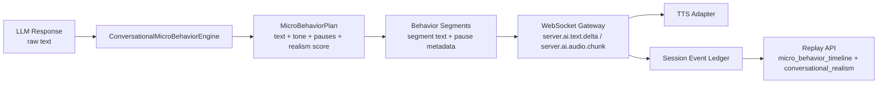

# DoorDrill Conversational Micro-Behaviors Engine

Repository snapshot analyzed and implemented on March 6, 2026.

## Purpose

The conversational micro-behaviors engine adds human-like messiness between the conversation model and the voice renderer. Instead of sending raw LLM output straight into TTS, DoorDrill now rewrites each AI turn into behavior-aware segments that can hesitate, use filler words, shift tone, vary sentence length, and simulate interruption-like delivery.

Implemented files:

- `backend/app/services/micro_behavior_engine.py`
- `backend/app/voice/ws.py`
- `backend/app/api/manager.py`
- `backend/app/schemas/session.py`

## Behavior Injection Architecture

Current runtime flow:

1. The websocket gateway collects the full raw LLM reply.
2. The micro-behavior engine transforms it into a `MicroBehaviorPlan`.
3. The plan is split into one or more segments.
4. Each segment is emitted as `server.ai.text.delta`.
5. Each segment is then fed to TTS with pause and tone metadata attached to `server.ai.audio.chunk`.
6. The turn summary is persisted in `server.turn.committed` with:
   - tone
   - sentence length profile
   - interruption type
   - pause profile
   - realism score

## Implemented Micro-Behaviors

### 1. Hesitation generation

The engine injects hesitation primarily for:

- `neutral`
- `skeptical`
- `curious`
- some `interested` responses

Examples:

- `Uh...`
- `Well...`
- `Hmm...`
- `Okay...`
- `So...`

Current logic:

- hesitation is suppressed for `annoyed` and `hostile`
- hesitation is likely when:
  - the rep got a neutral response quality signal
  - the homeowner is thinking through uncertainty
  - the reply is longer than a short rejection

Implementation detail:

- hesitation is added before sentence segmentation
- hesitation affects the opening pause duration

### 2. Filler word modeling

The engine injects filler phrases mostly for:

- `neutral`
- `curious`
- `interested`
- some `skeptical` turns

Examples:

- `you know`
- `like`
- `I mean`

Current logic:

- filler words are not used for `annoyed` or `hostile`
- filler insertion requires the response to be long enough to sound natural
- the engine tracks recent filler usage per session and avoids immediate reuse

Implementation detail:

- fillers are inserted into the first sentence rather than appended blindly
- session-local history prevents the same filler from repeating turn after turn

### 3. Interruptions

Two interruption concepts are modeled:

#### Homeowner cuts off rep mid-pitch

This is implemented today as an interruptive response style, not full duplex barge-in cancellation.

It triggers when:

- the homeowner is `annoyed` or `hostile`
- the rep behavior suggests pressure or objection neglect:
  - `ignores_objection`
  - `pushes_close`
  - `dismisses_concern`

Examples of injected openers:

- `Hold on,`
- `Wait,`
- `No, hold on,`
- `Sorry, let me stop you there,`

The turn is tagged as:

- `interruption_type = homeowner_cuts_off_rep`

#### Rep interrupts homeowner response

The current backend does not yet support true concurrent barge-in cancellation of AI audio. The implemented layer prepares for that by marking segments as `allow_barge_in` when the response is multi-segment or intentionally long.

That creates a future-ready seam for:

- stopping TTS playback mid-turn
- truncating remaining AI segments
- committing a partial homeowner turn

## Silence and Pause Modeling

The engine models pauses as metadata plus small runtime delays.

### Pause types

- short reaction pause
  - used for sharp, annoyed, and interruptive responses
- hesitation pause
  - used when the homeowner is skeptical, neutral, or thinking
- thinking pause
  - used for longer curious or exploratory replies

### Current pause strategy

- `exploratory`, `guarded`, and `measured` tones open with longer pauses
- `sharp`, `cutting`, and `confrontational` tones open quickly
- additional segments get inter-sentence pauses
- the websocket simulates only a capped delay to keep tests and local flows fast
- full pause values are still preserved in metadata

Persisted pause metadata:

- `pause_before_ms`
- `pause_after_ms`
- `pause_profile`
  - `opening_pause_ms`
  - `total_pause_ms`
  - `longest_pause_ms`

## Tone Modulation Design

Tone is computed from emotional transition plus rep behavior signals.

Current tone profiles:

- `measured`
- `guarded`
- `sharp`
- `confrontational`
- `exploratory`
- `warm`
- `warming`
- `cutting`

Examples:

- `neutral -> skeptical` => `guarded`
- `skeptical -> annoyed` => `sharp`
- `interested -> curious` => `exploratory`
- ignored objections while annoyed/hostile => `cutting`
- acknowledged concern while becoming curious/interested => `warming`

This tone value is attached to:

- `server.ai.text.delta`
- `server.ai.audio.chunk`
- `server.turn.committed`
- replay-derived micro-behavior timeline

## Natural Sentence Length Variation

The engine chooses a response length profile before segmentation:

- `short`
  - common for `hostile` and `annoyed`
  - example: `Not interested.`
- `medium`
  - common for `neutral` and `skeptical`
  - example: `We already use someone for that.`
- `long`
  - common for `curious` and `interested`
  - example: `Look, I get what you're saying, but we already signed a contract last month.`

Implementation detail:

- short responses keep only the first sentence or clause
- medium responses keep up to two sentences
- long responses preserve the full reply

## Replay and Observability Integration

Replay responses now expose:

- `micro_behavior_timeline`
- `conversational_realism`

Each micro-behavior timeline entry includes:

- `recorded_at`
- `stage`
- `emotion`
- `tone`
- `sentence_length`
- `behaviors`
- `interruption_type`
- `pause_profile`
- `realism_score`

This data is derived from persisted `server.turn.committed` events, so managers and future analytics pages can inspect realism behavior without replaying websocket traffic.

## Conversational Realism Metric (1-10)

The current scoring metric is a turn-level heuristic called `realism_score`.

### Score components

- base score: `5.0`
- hesitation present: `+0.8`
- filler behavior present: `+0.7`
- strong sentence-length choice (`short` or `long`): `+0.6`
- tone aligned to emotional transition: `+0.8`
- meaningful pause profile: `+0.7`
- interruption used appropriately: `+0.9`
- emotion/tone alignment under escalation: `+0.7`

The score is clamped to `1.0 - 10.0`.

### Interpretation

- `1-3`
  - robotic, flat, or tonally wrong
- `4-6`
  - passable but generic
- `7-8`
  - believable conversational variation
- `9-10`
  - highly natural, emotionally aligned, and varied

### Recommended future use

- average session realism
- scenario realism baselines
- provider comparison after real GPT-4o and ElevenLabs integration
- alerting when realism drops below a team threshold

## Integration with the Voice Pipeline

File: `backend/app/voice/ws.py`

Current integration points:

1. collect raw LLM output
2. call `micro_behaviors.apply_to_response(...)`
3. emit transformed text segments with:
   - tone
   - sentence length
   - pause metadata
   - interruption metadata
   - `allow_barge_in`
4. feed each segment into TTS
5. store a turn-level micro-behavior summary in the event ledger

This satisfies the required design constraint: the micro-behavior layer sits between LLM output and TTS.

## Current Constraints

- true rep barge-in during AI speech is not yet implemented
- the layer currently rewrites the full AI turn after the raw LLM reply is collected, rather than streaming-transforming partial tokens
- micro-behavior state is process-local
- realism scoring is heuristic, not judge-model based

## Recommended Next Steps

1. Add real duplex barge-in handling so `allow_barge_in` can actively stop TTS output.
2. Persist tone and realism score directly onto transcript turns for easier grading use.
3. Feed conversational realism into the grading pipeline as a separate rubric dimension.
4. Visualize `micro_behavior_timeline` in the manager replay UI.
