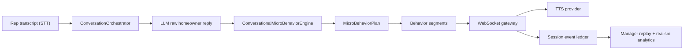

# DoorDrill Conversational Micro-Behaviors Engine

Implementation snapshot: March 6, 2026

## Objective

Increase roleplay realism by adding a behavior layer between the conversation model and the voice renderer. The layer takes the raw homeowner reply from the LLM, applies human conversational messiness, and then emits segment-aware text and audio events for TTS.

Implemented files:

- `backend/app/services/micro_behavior_engine.py`
- `backend/app/voice/ws.py`
- `backend/app/api/manager.py`
- `backend/app/schemas/session.py`

## Behavior Injection Architecture

Runtime flow:

1. `ConversationOrchestrator` updates stage, emotion, objection pressure, and behavioral signals from the rep turn.
2. The websocket gateway buffers the full raw LLM reply instead of streaming it straight to TTS.
3. `ConversationalMicroBehaviorEngine.apply_to_response(...)` transforms that raw text into a `MicroBehaviorPlan`.
4. The plan is emitted segment by segment as `server.ai.text.delta` and then passed to TTS as `server.ai.audio.chunk`.
5. `server.turn.committed` persists turn-level behavior metadata for replay and analytics.

## Hesitation Generation Logic

Hesitation is used when the homeowner sounds uncertain, thoughtful, or guarded.

Current rules:

- Enabled mainly for `neutral`, `skeptical`, and `curious`
- Suppressed for `annoyed` and `hostile`
- More likely when the raw reply is longer than a short rejection
- Triggered immediately when the rep turn is assessed as `neutral_delivery`

Current hesitation variants:

- `Uh...`
- `Well...`
- `Hmm...`
- `I mean...`
- `Okay...`
- `So...`

The engine keeps short per-session memory and avoids reusing the same hesitation variant on adjacent turns.

## Filler Word Modeling

Filler words are inserted only when they sound plausible for the current emotion and response length.

Current rules:

- Enabled for `neutral`, `curious`, and `interested`
- Sometimes used for `skeptical`
- Disabled for `annoyed` and `hostile`
- Disabled for very short replies
- Favored when the rep actually explains value, which tends to produce longer homeowner responses

Current filler variants:

- `you know`
- `like`
- `I mean`

Insertion strategy:

- The engine inserts the filler into the first sentence rather than blindly appending it
- Recent filler variants are tracked per session to prevent immediate repetition

## Interruption Modeling

The current system models interruption in two ways.

### 1. Interruptive homeowner phrasing

If the rep ignores objections, pushes the close, or dismisses a concern while the homeowner is `annoyed` or `hostile`, the response can be reframed as an interruptive cut-off.

Current openers:

- `Hold on,`
- `Wait,`
- `Look,`
- `No, hold on,`
- `Sorry, let me stop you there,`

This is persisted as:

- `interruption_type = homeowner_cuts_off_rep`

### 2. Barge-in ready delivery

Each segment also carries `allow_barge_in`. Longer or multi-segment replies are marked as interruptible so the websocket can stop emitting remaining audio when the rep starts talking.

## Pause Timing Strategy

Pauses are modeled in two forms:

- metadata persisted to replay
- capped runtime delays before and after emitted segments

Current pause rules:

- `exploratory`, `guarded`, and `measured` tones start with longer opening pauses
- `sharp`, `cutting`, and `confrontational` tones start quickly
- hesitation openers create longer first-segment pauses
- long responses get larger between-segment pauses than short responses

Persisted pause fields:

- `pause_before_ms`
- `pause_after_ms`
- `pause_profile.opening_pause_ms`
- `pause_profile.total_pause_ms`
- `pause_profile.longest_pause_ms`

Runtime note:

- The websocket caps actual pause sleeps to keep tests and local iteration fast
- Full intended pause values are still preserved in event metadata

## Tone Modulation Design

Tone is derived from emotional transition plus rep behavior quality.

Current tone mapping:

- `neutral -> skeptical` -> `guarded`
- `skeptical -> annoyed` -> `sharp`
- `interested -> curious` -> `exploratory`
- objection neglect while escalated -> `cutting`
- acknowledged concern plus softening emotion -> `warming`
- otherwise tone defaults to the destination emotion profile

Available tone outputs:

- `measured`
- `guarded`
- `sharp`
- `confrontational`
- `exploratory`
- `warm`
- `warming`
- `cutting`

Tone is attached to:

- `server.ai.text.delta`
- `server.ai.audio.chunk`
- `server.turn.committed`
- replay `micro_behavior_timeline`

## Natural Sentence Length Variation

The engine chooses a length profile before segmenting the reply.

Profiles:

- `short`
  - common for `hostile` and `annoyed`
  - example: `Not interested.`
- `medium`
  - common for `neutral` and `skeptical`
  - example: `We already use someone for that.`
- `long`
  - common for `curious` and `interested`
  - example: `Look, I get what you're saying, but we already signed a contract last month.`

Length policy:

- `short` trims to the first sentence or clause
- `medium` keeps up to two sentences
- `long` preserves the full reply

## Integration With The Voice Pipeline

The websocket now performs the integration seam required by this phase:

1. Receive full raw LLM output
2. Transform it through `ConversationalMicroBehaviorEngine`
3. Emit transformed segments as `server.ai.text.delta`
4. Feed the same transformed segments to TTS
5. Attach behavior metadata to:
   - text deltas
   - audio chunks
   - committed turn payloads

Committed turn payloads persist:

- `emotion_before`
- `emotion_after`
- `behavioral_signals`
- `micro_behavior.tone`
- `micro_behavior.sentence_length`
- `micro_behavior.behaviors`
- `micro_behavior.interruption_type`
- `micro_behavior.pause_profile`
- `micro_behavior.realism_score`

Replay now exposes:

- `micro_behavior_timeline`
- `conversational_realism`

## Conversational Realism Metric (1-10)

The current metric is a heuristic turn-level score named `realism_score`.

Base score:

- `5.0`

Additive signals:

- hesitation behavior: `+0.8`
- filler behavior: `+0.7`
- strong sentence-length choice (`short` or `long`): `+0.6`
- tone aligned with transition: `+0.8`
- meaningful opening pause: `+0.7`
- interruption used appropriately: `+0.9`
- escalated tone alignment under annoyance/hostility: `+0.7`

Clamp:

- minimum `1.0`
- maximum `10.0`

Interpretation:

- `1-3`: robotic or tonally wrong
- `4-6`: acceptable but plain
- `7-8`: realistic and varied
- `9-10`: highly lifelike, emotionally aligned, and non-repetitive

Replay aggregation:

- `conversational_realism.turn_count`
- `conversational_realism.average_score`
- `conversational_realism.latest_score`
- `conversational_realism.min_score`
- `conversational_realism.max_score`
