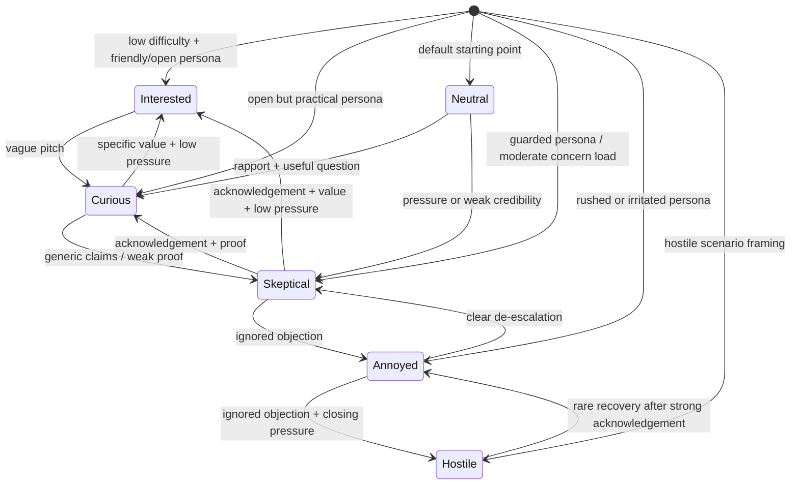

# Emotion Simulation Engine

## Purpose

DoorDrill's homeowner simulator now uses an explicit emotional state machine instead of a single resistance heuristic. The goal is to make objection handling feel more like a real door interaction: homeowner emotion changes when the rep acknowledges concerns, earns trust, ignores friction, or applies pressure too early.

## Emotional State Diagram

## Starting State Rules

- Persona attitude is parsed first. Natural-language values like `friendly but practical`, `hurried and impatient`, or `skeptical and cost-focused` are converted into the nearest emotion.
- Scenario difficulty hardens the starting state. Difficulty `4-5` shifts toward `annoyed`/`hostile`; difficulty `1` softens toward `curious`/`interested`.
- Buy likelihood biases the opener. `high` lowers resistance; `medium-low` and `low` increase it.
- Concern load matters. Large objection queues and stacked concerns raise objection pressure before the first rep turn.

## Transition Rules

- `acknowledges_concern`, `provides_proof`, `explains_value`, `reduces_pressure`, `builds_rapport`, and `invites_dialogue` lower objection pressure.
- `pushes_close`, `dismisses_concern`, and `ignores_objection` raise objection pressure.
- Ignoring active objections can surface the next queued objection, turning a single concern into a stacked objection sequence.
- High objection pressure drives emotional hardening:
  - `0-1` pressure favors `interested` or `curious`
  - `2-3` pressure favors `neutral` or `skeptical`
  - `4` pressure forces `annoyed`
  - `5` pressure forces `hostile`
- Recovery is intentionally asymmetric: it is easier to move `neutral -> skeptical` than `hostile -> interested`.

## Integration Points

- [backend/app/services/conversation_orchestrator.py](/Users/calelamb/Desktop/personal projects/doordrill/backend/app/services/conversation_orchestrator.py)
  - infers the starting emotion from persona + scenario
  - tracks `active_objections`, `queued_objections`, `resolved_objections`, and `objection_pressure`
  - updates emotion after each rep turn and rebuilds the system prompt with the latest state
- [backend/app/voice/ws.py](/Users/calelamb/Desktop/personal projects/doordrill/backend/app/voice/ws.py)
  - emits the initial homeowner state on websocket connect
  - emits `homeowner_state_updated` after each rep turn so replay, analytics, and adaptive training can see emotion transitions
- Prompt layer
  - the conversation prompt now includes current emotion, objection pressure, active unresolved objections, latent objections still available to surface, and recently resolved objections

## Behavioral Response Examples

- `interested`: "That sounds useful. What would the first visit actually look like?"
- `curious`: "Okay, how is your service different from what most companies do?"
- `neutral`: "All right. Give me the short version."
- `skeptical`: "I've heard that before. What proof do you have that it's worth it?"
- `annoyed`: "I'm busy. If you have a point, make it quickly."
- `hostile`: "No, you're not listening. I'm not doing this right now."

## Practical Effect

- Good reps can now lower resistance by resolving the actual concern in front of them.
- Weak reps trigger escalation instead of repeating the same objection forever.
- The LLM receives concrete state context, so homeowner replies stay emotionally consistent across the session.
