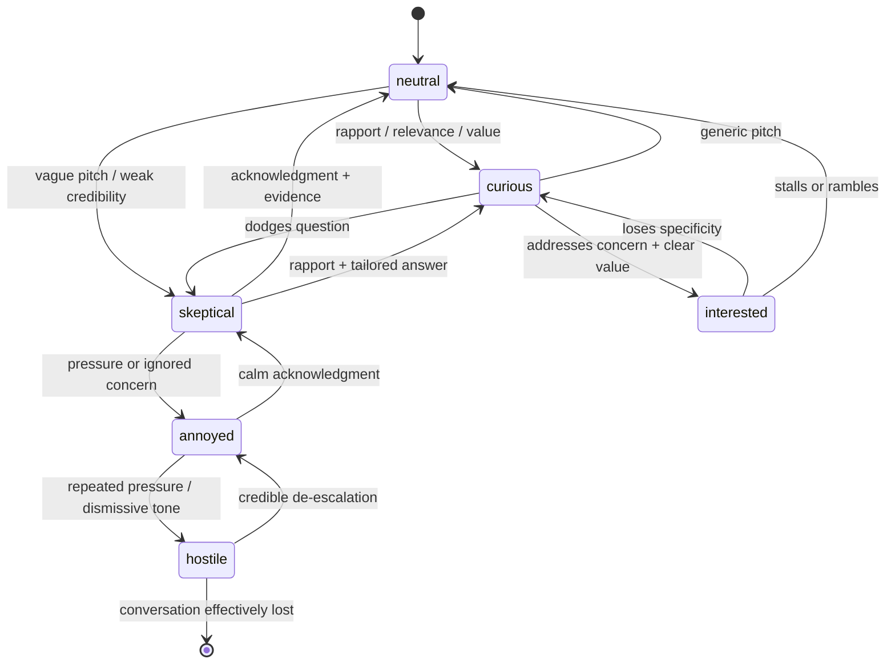

# DoorDrill Emotion Simulation Engine

Repository snapshot analyzed and implemented on March 6, 2026.

## Purpose

The emotion simulation engine upgrades the AI homeowner from a stage-only responder into a stateful character whose openness or resistance changes based on rep behavior, scenario difficulty, and persona inputs.

Implemented entry points:

- `backend/app/services/conversation_orchestrator.py`
- `backend/app/voice/ws.py`
- `backend/app/services/provider_clients.py`
- `backend/app/api/manager.py`

## Emotional State Model

The homeowner now moves across six core emotional states:

- `interested`
- `curious`
- `neutral`
- `skeptical`
- `annoyed`
- `hostile`

These are represented internally as an ordered resistance scale:

```text
interested -> curious -> neutral -> skeptical -> annoyed -> hostile
```

Lower resistance means more openness. Higher resistance means the rep is losing the door.

## Emotional State Diagram



## Starting State Logic

The starting state is determined when the websocket session opens and the orchestrator is initialized from the `Scenario` row.

Inputs used:

- `scenario.persona.attitude`
- `scenario.persona.concerns`
- `scenario.description`
- `scenario.difficulty`
- `scenario.stages`

Current starting-state rules:

- `persona.attitude=hostile` -> `hostile`
- `persona.attitude=annoyed` or `busy` -> `annoyed`
- `persona.attitude=skeptical` -> `skeptical`
- `persona.attitude=curious` -> `curious`
- `persona.attitude=interested` -> `interested`
- no strong signal -> `neutral`
- `difficulty >= 4` shifts one step more resistant
- `difficulty <= 1` can soften `neutral` to `curious`
- multiple seeded concerns can shift `neutral` or `curious` toward `skeptical`

Seeded unresolved objections are derived from persona concerns and scenario description. Current normalized objection tags are:

- `price`
- `trust`
- `timing`
- `spouse`
- `incumbent_provider`

## Transition Rules

Each rep utterance is evaluated for behavioral signals. Those signals move the resistance scale up or down.

### De-escalation signals

- `acknowledges_concern`
  - Triggered by phrases such as `I understand`, `that makes sense`, `totally fair`
  - Effect: `-1` resistance
- `builds_rapport`
  - Triggered by phrases such as `appreciate your time`, `neighbor`, `local`
  - Effect: `-1` resistance
- `explains_value`
  - Triggered by words such as `save`, `protect`, `service`, `inspection`
  - Effect: `-1` resistance

### Escalation signals

- `pushes_close`
  - Triggered by phrases such as `sign today`, `right now`, `close this`
  - Effect: `+1` resistance
- `dismisses_concern`
  - Triggered by phrases such as `trust me`, `you need to`, `you're wrong`
  - Effect: `+2` resistance
- `ignores_objection`
  - Triggered when unresolved objections exist and the rep pushes forward without acknowledging or addressing them
  - Effect: `+1` resistance
- `high_difficulty_backfire`
  - Triggered when the scenario is hard and the rep uses pushy or dismissive behavior
  - Effect: additional `+1` resistance

### Objection resolution logic

- If a rep de-escalates and explicitly addresses an objection tag, that objection is removed from the active unresolved list.
- If a rep escalates or stays evasive, unresolved objections persist and new objection tags can be added.

## Integration Points

### 1. Session initialization

File: `backend/app/voice/ws.py`

- On websocket connect, the gateway loads the `Scenario`
- The gateway calls `ConversationOrchestrator.initialize_session(...)`
- The connected event now includes:
  - `stage`
  - `emotion`
  - `active_objections`

### 2. Rep-turn planning

File: `backend/app/services/conversation_orchestrator.py`

`prepare_rep_turn(...)` now returns:

- `stage_before`
- `stage_after`
- `emotion_before`
- `emotion_after`
- `objection_tags`
- `active_objections`
- `behavioral_signals`
- `resistance_level`
- `system_prompt`

This is the core state-machine transition point.

### 3. Prompt construction

The system prompt now includes:

- scenario name
- scenario description
- current stage
- current emotional state
- persona attitude
- seeded concerns
- active unresolved objections
- behavior guidance tied to the current emotional state

### 4. LLM response generation

File: `backend/app/services/provider_clients.py`

The LLM adapter contract now receives:

- `rep_text`
- `stage`
- `emotion`
- `active_objections`
- `system_prompt`

The mock LLM uses emotion to vary tone:

- interested: practical next-step openness
- curious: exploratory questions
- skeptical: doubt and proof-seeking
- annoyed: impatience
- hostile: sharp resistance

### 5. Websocket event payloads

Files:

- `backend/app/voice/ws.py`
- `backend/app/services/ledger_service.py`

Emotion-aware fields are now emitted in:

- `server.session.state`
- `server.stt.final`
- `server.ai.text.delta`
- `server.turn.committed`

This means emotion changes are persisted in `session_events` and available for replay analysis.

### 6. Manager replay visibility

File: `backend/app/api/manager.py`

Replay responses now include `emotion_timeline`, derived from persisted `server.session.state` events.

Each timeline entry includes:

- `emotion`
- `recorded_at`
- `stage`
- `behavioral_signals`
- `active_objections`

## Behavioral Response Examples

### `neutral`

- "I hear what you're saying, but what is this exactly?"
- "Okay, give me the quick version."

### `skeptical`

- "That sounds good, but how do I know it actually works?"
- "Why would I switch from what I'm already doing?"

### `annoyed`

- "I'm busy, so if you have a point, get to it."
- "You're not really answering what I asked."

### `interested`

- "If this fits, what would the next step be?"
- "How would this help my house specifically?"

### `hostile`

- "I don't want a pushy sales pitch at my door."
- "If you're not listening, this conversation is over."

### `curious`

- "What makes your service different from the others?"
- "How does that actually work in practice?"

## Current Constraints

This is a meaningful upgrade, but it is still bounded by the current repository architecture:

- Emotion is process-local, not persisted as canonical conversation state
- Turn rows do not yet store emotion directly; replay derives it from session events
- The provider layer still uses mock behavior under the real adapter interfaces
- Objection detection remains heuristic and keyword-driven

## Recommended Next Steps

1. Persist emotion snapshots per turn so grading can use them directly.
2. Teach the grading service to score de-escalation and objection recovery quality.
3. Replace keyword heuristics with structured classifier outputs from the conversation model.
4. Add dashboard visualization of `emotion_timeline` alongside stage and objection timelines.
