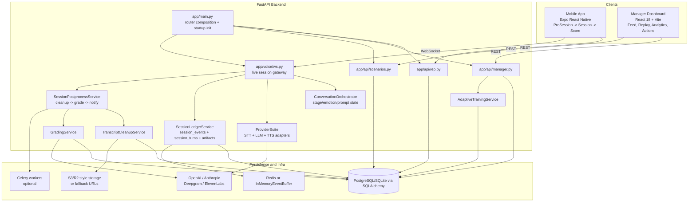
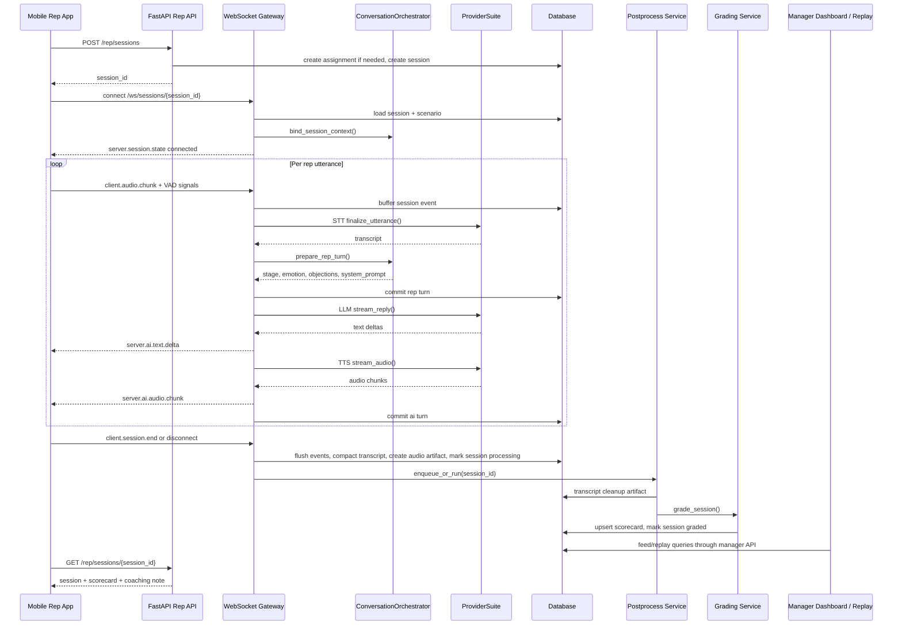

# DoorDrill System Architecture Analysis

Repository snapshot analyzed on March 6, 2026.

## Executive Summary

DoorDrill currently ships as a three-surface system:

- an Expo mobile app for reps to start and run drills
- a FastAPI backend that owns session state, persistence, post-processing, and manager APIs
- a React/Vite dashboard for manager feed, replay, analytics, and follow-up actions

The core training loop is implemented and test-covered: assignment or practice session creation, live websocket drill, transcript/event persistence, post-session cleanup, grading, and manager replay/feed consumption. The largest architectural gap is that several "versioned" or "intelligent" pieces are present only partially: prompt versions are stored but not executed dynamically, rubric JSON is persisted but not applied during grading, micro-behavior logic exists but is not wired into the websocket path, and audio artifact storage is modeled as presigned URLs rather than completed uploads.

## Architecture Diagram

## Component Responsibilities

| Component | Files | Responsibility |
| --- | --- | --- |
| Mobile rep experience | `mobile/src/screens/PreSessionScreen.tsx`, `mobile/src/screens/SessionScreen.tsx`, `mobile/src/screens/ScoreScreen.tsx` | Starts sessions, streams audio/VAD over websocket, plays AI audio, polls for scorecards after session end |
| Manager dashboard | `dashboard/src/App.tsx`, `dashboard/src/lib/api.ts`, `dashboard/src/pages/ManagerFeedPage.tsx`, `dashboard/src/pages/ManagerReplayPage.tsx` | Consumes manager feed, replay, analytics, and follow-up endpoints |
| API composition | `backend/app/main.py` | Initializes DB on startup and registers REST + websocket routers |
| Rep API | `backend/app/api/rep.py` | Creates sessions, exposes session details/history/progress, returns rep-visible coaching note |
| Manager API | `backend/app/api/manager.py` | Manages assignments, feed, replay, reviews, coaching notes, analytics, and adaptive training endpoints |
| Scenario API | `backend/app/api/scenarios.py` | CRUD for scenarios with org scoping |
| Websocket session runtime | `backend/app/voice/ws.py` | Authenticates websocket clients, runs the turn loop, persists events/turns, finalizes sessions |
| Conversation state engine | `backend/app/services/conversation_orchestrator.py` | Holds per-session in-memory state, detects stage/emotion changes, builds conversation prompts |
| Prompt version metadata | `backend/app/models/prompt_version.py`, `backend/app/db/init_db.py` | Stores prompt version labels and template blueprints, but does not drive runtime prompt execution |
| Provider abstraction | `backend/app/services/provider_clients.py` | Wraps Deepgram/OpenAI/Anthropic/ElevenLabs with mock fallbacks |
| Event and transcript ledger | `backend/app/services/ledger_service.py`, `backend/app/services/ledger_buffer.py` | Buffers websocket events, flushes them to `session_events`, commits `session_turns`, creates transcript artifacts |
| Post-session pipeline | `backend/app/services/session_postprocess_service.py`, `backend/app/tasks/post_session_tasks.py` | Runs cleanup, grading, and notifications inline or via Celery |
| Transcript cleanup | `backend/app/services/transcript_cleanup_service.py` | Normalizes turns and optionally re-transcribes uploaded audio with Whisper |
| Grading | `backend/app/services/grading_service.py` | Builds grading prompts, calls OpenAI JSON mode if configured, normalizes fallback results, stores scorecards |
| Adaptive training | `backend/app/services/adaptive_training_service.py` | Converts historical session/scorecard data into skill profiles and scenario recommendations |
| Persistence model | `backend/app/models/*.py` | Stores users, assignments, scenarios, sessions, events, turns, artifacts, scorecards, reviews, and analytics facts |

## 1. Conversation Engine Structure

The live conversation engine is split between the websocket gateway and the orchestrator:

- `backend/app/voice/ws.py` owns the runtime loop.
- `backend/app/services/conversation_orchestrator.py` owns the in-memory state machine.
- `backend/app/services/provider_clients.py` owns external provider I/O.
- `backend/app/services/ledger_service.py` owns durable event and turn persistence.

### Runtime shape

1. `POST /rep/sessions` creates a `sessions` row and stamps `prompt_version`.
2. The mobile client opens `WS /ws/sessions/{session_id}`.
3. `session_ws()` loads the `Session`, `Scenario`, and actor, then binds scenario context into the orchestrator.
4. Client events are accepted through an `asyncio.Queue`:
   - `client.audio.chunk`
   - `client.vad.state`
   - `client.session.end`
5. Each rep utterance goes through:
   - STT finalization
   - stage/emotion/objection evaluation
   - rep turn persistence
   - streamed LLM response
   - streamed TTS response
   - AI turn persistence
6. On disconnect or session end, the gateway:
   - flushes buffered events
   - compacts transcript turns into an artifact
   - creates an audio artifact record
   - marks the session `processing`
   - marks the assignment `completed`
   - triggers post-session cleanup, grading, and notification work

### What the websocket layer handles directly

- STT partial emission via `server.stt.partial`
- final STT emission via `server.stt.final`
- AI text token streaming via `server.ai.text.delta`
- AI audio chunk streaming via `server.ai.audio.chunk`
- stage transitions through `server.session.state`
- interruption/barge-in detection via `client.vad.state` and `client.audio.chunk`
- silence filler generation when the rep stops talking for `SILENCE_FILLER_SECONDS`

### State model

`ConversationState` tracks:

- `stage`
- `emotion`
- `resistance_level`
- rep and AI turn counts
- `rapport_score`
- `active_objections`
- `last_behavior_signals`

This state is process-local. It is stored in Python dictionaries keyed by `session_id`, not in the database or Redis.

### Notable non-participating code

`backend/app/services/micro_behavior_engine.py` is a richer persona-response post-processor, but it is not called from `backend/app/voice/ws.py`. Its behavior is validated only in tests today.

## 2. Prompt Construction Logic

Prompting is split into two separate builders.

### Conversation prompt construction

`PromptBuilder.build()` in `backend/app/services/conversation_orchestrator.py` builds the live system prompt from:

- `ScenarioSnapshot`
- `HomeownerPersona`
- current stage
- current emotion
- resistance level
- active objections
- recent behavioral signals
- the `session.prompt_version` string

The prompt is structured as layered instructions:

1. immersion contract
2. persona profile
3. stage instructions
4. emotional context
5. anti-pattern guards

The system prompt is passed to the LLM adapter as the system message. The rep utterance is passed as the user message.

### Important prompt-version limitation

The database stores prompt versions in `prompt_versions`, and `sessions.prompt_version` is stamped from the active row at session creation. But runtime prompt generation does not load `PromptVersion.content`; it only injects the version string into the generated prompt. In practice:

- prompt templates are hardcoded in Python
- `PromptVersion` is metadata, not the source of truth

### Conversation memory limitation

The OpenAI and Anthropic adapters attempt to maintain conversation history with `_TaskConversationHistoryMixin`. That history is keyed by the current asyncio task. Because `backend/app/voice/ws.py` creates a fresh `llm_worker` task for each response, prior turns are not carried into the next turn's LLM call. The effective live prompt context is therefore:

- current system prompt
- current rep utterance
- no durable multi-turn transcript history

### Grading prompt construction

`GradingPromptBuilder.build()` in `backend/app/services/grading_service.py` builds a separate prompt that contains:

- grading instructions
- weighted category rules
- the JSON schema from `StructuredScorecardPayload`
- the full transcript as numbered turn rows

This grading prompt is far closer to transcript-wide evaluation than the live conversation prompt.

## 3. Persona Modeling Implementation

Persona modeling is implemented in schema, orchestration, and voice selection, but only partially in response realism.

### Persona source of truth

Scenario personas live in `Scenario.persona` and commonly contain:

- `name`
- `attitude`
- `concerns`
- `objection_queue`
- `buy_likelihood`
- `softening_condition`
- optional `voice_id`

### Runtime persona usage

`HomeownerPersona.from_payload()` and `ScenarioSnapshot.from_scenario()` convert scenario JSON into runtime context. That context influences:

- starting emotion via `PERSONA_ATTITUDE_TO_EMOTION`
- seeded objections from persona concerns and objection queue
- prompt layer content
- resistance changes after rep behavior
- optional TTS voice selection when `persona.voice_id` is present

### Persona gaps

- persona rubric alignment is not enforced in the grader
- persona does not alter stage progression rules beyond initial conditions
- micro-behavior realism is not applied in the live path
- no persona state is persisted independently of session memory

## 4. Scenario Structure

Scenarios are fully modeled as durable domain objects.

### Schema

`backend/app/models/scenario.py` stores:

- `name`
- `industry`
- `difficulty`
- `description`
- `persona` JSON
- `rubric` JSON
- `stages` JSON
- `created_by_id`

### Lifecycle

- `backend/app/api/scenarios.py` exposes list, read, create, and update endpoints
- `backend/app/db/init_db.py` seeds `PHASE_ONE_SCENARIOS`
- seeded scenarios all use `STANDARD_RUBRIC` and `PHASE_ONE_STAGES`

### Runtime usage

At session start, the websocket gateway loads the scenario and binds it into the orchestrator. The live runtime uses:

- `difficulty`
- `description`
- `persona`
- `stages`

The live runtime does not use:

- `rubric`

### Downstream usage

Scenarios are also consumed by:

- assignment creation
- feed and replay enrichment
- adaptive training recommendations
- manager analytics breakdowns

## 5. Grading Engine Implementation

The grading engine is implemented as a post-session pipeline, not as part of the websocket turn loop.

### Pipeline stages

`SessionPostprocessService` runs three task types:

1. `cleanup`
2. `grade`
3. `notify`

It can run:

- inline in the API process
- or via Celery queues if `USE_CELERY=true`

### Transcript cleanup

`TranscriptCleanupService.cleanup_session_transcript()`:

- reads ordered `session_turns`
- normalizes whitespace
- stores a `transcript_cleanup` artifact
- optionally tries Whisper re-transcription against the latest `audio` artifact

### Grading service

`GradingService.grade_session()`:

- loads the session and turns
- builds a transcript-wide grading prompt
- attempts an OpenAI chat completion in JSON mode
- falls back to deterministic heuristics if no key or provider failure occurs
- writes or updates the `scorecards` row
- marks the session `graded`
- refreshes analytics materialization through `AnalyticsRefreshService`

### Category model

The grader uses five fixed categories:

- `opening` = 15%
- `pitch_delivery` = 25%
- `objection_handling` = 30%
- `closing_technique` = 20%
- `professionalism` = 10%

### Grading normalization

The service validates and clamps:

- category scores
- overall score
- evidence turn IDs
- highlight structure
- weakness tags
- summary length

### Current divergence from target architecture

- grading uses OpenAI, not Claude Opus
- grading is transcript-wide but not scenario-rubric-aware
- fallback grading is lightweight heuristic scoring, not an LLM-as-judge equivalent

## 6. Training Loop Flow From Session Start To Scoring

### Step-by-step narrative

1. The mobile pre-session screen loads the assignment and scenario, then calls `createRepSession()`.
2. The rep session is created in `backend/app/api/rep.py`, including a `prompt_version` label from the active prompt row.
3. The live drill runs entirely inside `backend/app/voice/ws.py`.
4. Each utterance is persisted twice:
   - as raw websocket events in `session_events`
   - as normalized conversational turns in `session_turns`
5. When the drill ends, the session enters `processing`.
6. Cleanup and grading run inline or asynchronously.
7. The rep score screen polls `GET /rep/sessions/{session_id}` until a scorecard exists.
8. The manager dashboard reads the same persisted session through feed and replay endpoints.

## 7. System Data Flow

### Assignment and session bootstrap

- Managers create assignments through `POST /manager/assignments`.
- Reps can also start a practice session without an assignment; `create_session()` auto-creates one.
- Session rows join rep, scenario, and assignment identities early, so later replay/feed queries do not have to reconstruct ownership.

### Live event flow

- raw client and server websocket events are buffered in Redis or memory
- periodic flushes persist them to `session_events`
- committed transcript turns persist to `session_turns`
- state transitions persist as `server.session.state` events

### Post-session artifact flow

- transcript compaction creates a `canonical_transcript` artifact
- cleanup creates a `transcript_cleanup` artifact
- audio finalization creates an `audio` artifact record containing upload metadata

### Consumption flow

- rep score screen consumes `session`, `scorecard`, and the latest rep-visible coaching note
- manager feed joins `assignments`, `sessions`, `scorecards`, and `manager_reviews`
- manager replay joins turns, events, artifacts, reviews, and scenario metadata
- adaptive training reads scored historical sessions and scorecards to recommend next scenarios

## 8. Potential Architectural Risks

1. Process-local conversation state can be lost or split. `ConversationOrchestrator` stores state in memory, so process restarts or multi-worker websocket routing can break stage and emotion continuity.
2. Multi-turn LLM memory is effectively absent. Provider history is keyed to per-response asyncio tasks, so each LLM call behaves like a fresh turn with no transcript history beyond the current utterance.
3. Prompt versioning is cosmetic. `PromptVersion.content` is seeded and stored, but runtime prompt generation ignores it, which blocks true prompt rollout, rollback, and auditability.
4. Scenario rubrics are not enforced. `Scenario.rubric` is persisted but the grader uses fixed global weights, so scenario-specific evaluation logic does not exist yet.
5. Mobile websocket auth is not production-ready. `SessionWsClient` opens the websocket without headers or `access_token`, so enabling strict websocket auth will break the mobile client until auth transport is added.
6. Audio format expectations are misaligned. The mobile recorder emits AAC/M4A, while the Deepgram path is tuned for linear16 or opus; real STT quality will depend on fallback behavior unless codec handling is tightened.
7. Audio artifacts may reference objects that do not exist. Session finalization stores presigned upload metadata, but the backend does not itself upload accumulated session audio bytes, which makes replay audio URLs and Whisper cleanup fragile.
8. Turn indexing can race under concurrent connections. `_next_turn_index()` counts existing turns on each commit, so overlapping websocket connections for the same session could collide without a stronger concurrency guard.
9. Response realism is only partially wired. `MicroBehaviorEngine` exists but is not applied in the live path, so persona nuance and speech cadence depend mostly on the base LLM output and TTS streaming.
10. Provider behavior diverges from the product spec. The current implementation supports Deepgram/OpenAI/Anthropic/ElevenLabs conditionally, but defaults to mock providers in development and uses OpenAI rather than Claude for grading.

## Bottom Line

DoorDrill already has a coherent backbone: session creation, real-time drill orchestration, durable ledgers, post-session grading, manager replay/feed, and adaptive follow-up recommendations all exist in the repository. The next architectural maturity step is not adding new surfaces; it is tightening the execution of existing ones by making prompt versions executable, preserving conversational memory across turns and workers, aligning audio storage and auth with production requirements, and making scenario rubrics first-class inputs to grading.
