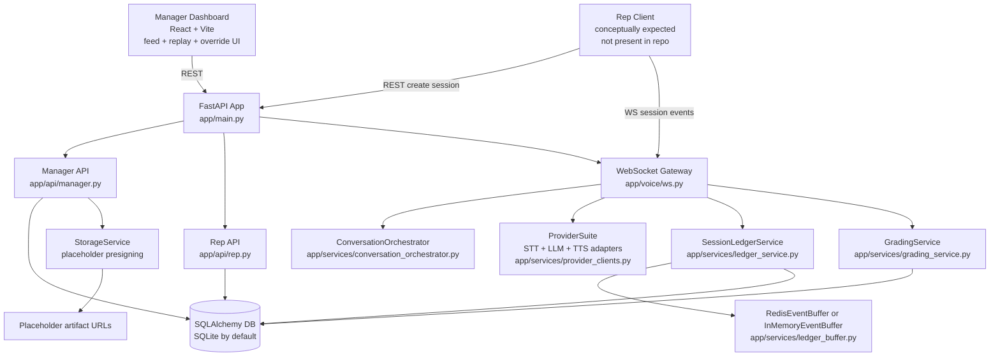
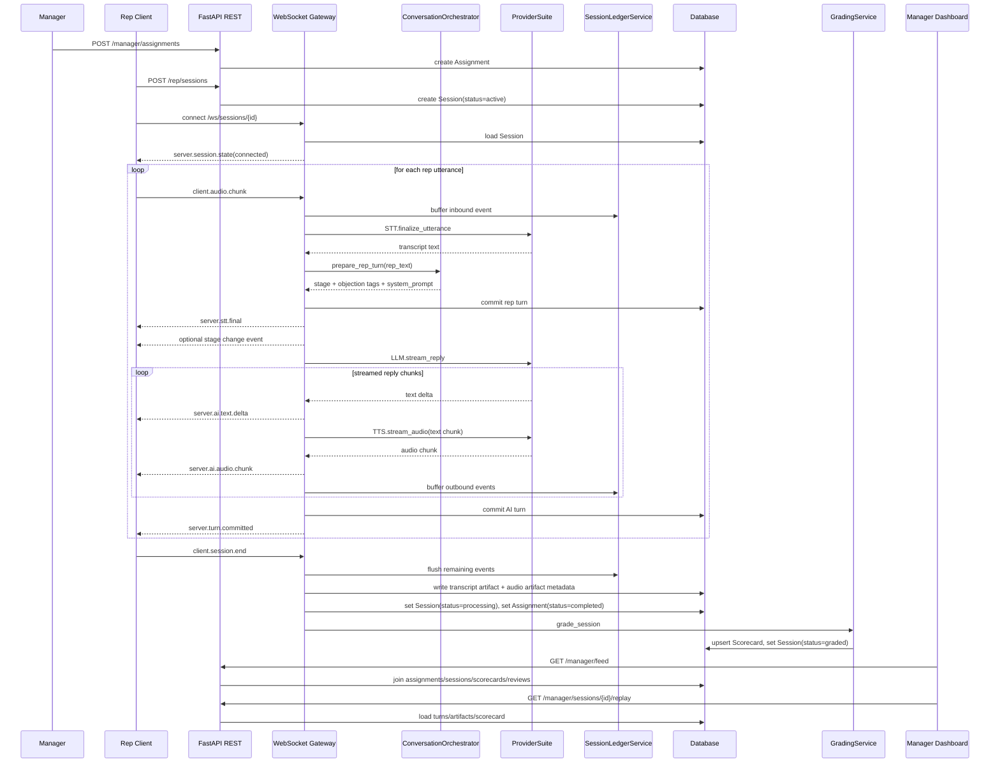

# DoorDrill System Architecture Analysis

Repository snapshot analyzed on March 6, 2026.

## Scope and Current Reality

This document describes the architecture that is actually implemented in this repository today, not the full target-state platform described in the bootstrap prompt.

What exists now:

- A FastAPI backend with REST endpoints, a websocket voice gateway, persistence models, and a minimal grading pipeline
- A small React manager dashboard scaffold for feed and replay workflows
- Tests covering the backend assignment -> session -> grading -> manager review flow

What does not exist in this repo today:

- The Expo mobile client referenced in the bootstrap prompt
- Real Deepgram, OpenAI, or ElevenLabs streaming integrations
- Async grading via Celery or a separate worker process
- Real S3/R2 artifact upload and presigned URLs
- Analytics, alerts, benchmarks, command-center, or coaching-note endpoints described in roadmap docs

## High-Level Architecture



## Repository Architecture Map

### Backend entry and composition

- `backend/app/main.py`
  - Creates the FastAPI app
  - Initializes the database on startup
  - Registers manager REST routes, rep REST routes, and websocket routes
- `backend/app/core/config.py`
  - Central settings source
  - Defaults to SQLite and optional Redis
  - Chooses provider adapters with env-driven flags
- `backend/app/db/session.py`
  - Creates the SQLAlchemy engine and session factory

### API layer

- `backend/app/api/rep.py`
  - Lists assignments for a rep
  - Creates a new drill session
  - Returns session + scorecard data after grading
- `backend/app/api/manager.py`
  - Creates assignments
  - Creates follow-up assignments from scorecards
  - Returns manager feed
  - Returns replay data
  - Accepts score overrides and notes

### Real-time session layer

- `backend/app/voice/ws.py`
  - Accepts websocket connections for session runtime
  - Validates supported client event types
  - Buffers every inbound and outbound event
  - Converts rep audio payloads into transcript text through the STT adapter
  - Advances conversation state
  - Streams text and audio responses back to the client
  - Commits transcript turns
  - Finalizes the session and triggers grading

### Domain services

- `backend/app/services/conversation_orchestrator.py`
  - Holds in-memory conversation state keyed by `session_id`
  - Detects stage transitions with keyword heuristics
  - Extracts objection tags with keyword heuristics
  - Builds the current system prompt
- `backend/app/services/provider_clients.py`
  - Provides STT, LLM, and TTS abstraction points
  - Currently all real providers fall back to deterministic mock behavior
- `backend/app/services/ledger_buffer.py`
  - Buffers websocket events in memory or Redis
- `backend/app/services/ledger_service.py`
  - Flushes buffered events to `session_events`
  - Commits normalized transcript turns to `session_turns`
  - Compacts turns into a canonical transcript artifact
- `backend/app/services/grading_service.py`
  - Produces a scorecard from completed session turns
  - Uses local heuristics, not an external judge model
- `backend/app/services/manager_feed_service.py`
  - Builds feed rows from assignments, sessions, scorecards, and manager reviews
- `backend/app/services/storage_service.py`
  - Returns placeholder URLs for stored artifacts

### Persistence model

- `backend/app/models/scenario.py`
  - Stores scenario metadata, persona JSON, rubric JSON, and stage list
- `backend/app/models/assignment.py`
  - Binds a scenario to a rep with due date, target score, and retry policy
- `backend/app/models/session.py`
  - Stores session lifecycle, raw event ledger, transcript turns, and artifacts
- `backend/app/models/scorecard.py`
  - Stores grading outputs and manager review audit rows
- `backend/app/models/user.py`
  - Stores organizations, teams, and users

### Frontend scaffold

- `dashboard/src/App.tsx`
  - Loads manager feed and selected replay
- `dashboard/src/lib/api.ts`
  - Fetch wrappers for feed, replay, override, and follow-up endpoints
- `dashboard/src/components/FeedList.tsx`
  - Shows sessions in the manager feed
- `dashboard/src/components/ReplayPanel.tsx`
  - Shows transcript, stage timeline, weaknesses, and manager actions

## Requested Deep-Dive Analysis

### 1. Conversation engine structure

The conversation engine is centered on `backend/app/voice/ws.py` and `backend/app/services/conversation_orchestrator.py`.

Runtime structure:

1. `POST /rep/sessions` creates a `sessions` row with `status=active`
2. `WS /ws/sessions/{session_id}` accepts the live session
3. The websocket gateway loads the `Session` row and starts a loop
4. For every `client.audio.chunk` event:
   - the raw event is buffered into the session ledger
   - STT finalization is requested from the provider adapter
   - the orchestrator computes stage transition, objection tags, and a system prompt
   - the rep turn is committed to `session_turns`
   - the LLM adapter streams response text deltas
   - each text delta is sent to the client and buffered into the ledger
   - each text delta is also passed into TTS streaming
   - TTS audio chunks are sent to the client and buffered into the ledger
   - once streaming ends, the final AI turn is committed to `session_turns`
5. On `client.session.end`, the gateway flushes events, compacts transcript artifacts, marks the assignment complete, and calls grading

Important implementation detail:

- Conversation state is not persisted in the database or Redis
- `ConversationOrchestrator` keeps a process-local dictionary of `ConversationState`
- That means stage state is lost on process restart and is not shared across workers

### 2. Prompt construction logic

Prompt construction is minimal and is entirely implemented in `ConversationOrchestrator._build_system_prompt`.

Current prompt shape:

```text
You are a homeowner in a door-to-door sales roleplay.
Stay realistic, challenge weak claims, and keep responses concise.
Current stage: <stage>.
```

Key observations:

- The prompt only uses the inferred stage
- It does not load the `Scenario` row from the database
- It does not include `Scenario.persona`
- It does not include `Scenario.rubric`
- It does not include prior transcript turns
- It does not include assignment context, rep metadata, or organizational context

The LLM adapter contract in `provider_clients.py` receives only:

- `rep_text`
- `stage`
- `system_prompt`

This means the actual conversation behavior today is mostly driven by:

- keyword-based stage classification in the orchestrator
- keyword-based branching in the mock LLM client

### 3. Persona modeling implementation

Persona modeling exists only as stored data, not as runtime behavior.

Implemented persona representation:

- `Scenario.persona: JSON`
- Seeded in tests with values such as:
  - `attitude`
  - `concerns`

Current limitations:

- The websocket runtime never queries the `Scenario` table
- The orchestrator never reads `persona`
- The provider adapters never receive persona fields
- No voice, temperament, objection schedule, or buying propensity is modeled beyond hardcoded string heuristics

Net result:

- Persona is present in the schema as future architecture
- Persona is absent from live session execution

### 4. Scenario structure

Scenario structure is implemented in `backend/app/models/scenario.py` as:

- `id`
- `name`
- `industry`
- `difficulty`
- `description`
- `persona` JSON
- `rubric` JSON
- `stages` JSON list
- `created_by_id`

Scenarios are referenced by:

- `assignments.scenario_id`
- `sessions.scenario_id`

What the runtime uses:

- Only the raw `scenario_id` is carried through assignment and session creation
- The websocket layer does not hydrate the scenario object during conversation
- Stage progression uses hardcoded stage names in `ConversationOrchestrator`

This creates a mismatch:

- The schema supports configurable scenarios
- The runtime currently behaves as if every scenario is the same generic homeowner flow

### 5. Grading engine implementation

The grading engine is implemented in `backend/app/services/grading_service.py`.

Current grading behavior:

1. Load the `Session`
2. Read `session.turns`
3. Split turns into rep turns and AI turns
4. Derive category scores from simple heuristics:
   - more rep turns raise opening and pitch scores
   - mentions of `price` raise objection-handling score
   - mentions of `schedule` or `today` raise closing score
   - presence of AI turns slightly raises professionalism
5. Average the categories into `overall_score`
6. Infer `weakness_tags` from categories under `7.0`
7. Create fixed-format highlights and a fixed AI summary
8. Upsert the `Scorecard`
9. Mark the session `graded`

Important architectural reality:

- Despite the async method signature, grading is invoked inline from websocket finalization
- There is no Celery queue, no worker boundary, and no retry system
- The grading rubric stored on `Scenario.rubric` is not used
- Category names in code do not exactly match the bootstrap weights table

### 6. Training loop flow from session start to scoring



## Component Responsibilities

### FastAPI app

- Compose routers
- Initialize persistence
- Provide healthcheck

### Rep API

- Session creation and rep access to session outcomes
- Assignment discovery for the rep workflow

### Manager API

- Assignment creation
- Review workflow
- Replay retrieval
- Follow-up assignment routing

### Websocket gateway

- Own the live drill loop
- Normalize event protocol
- Mediate providers
- Capture transport telemetry
- Trigger post-session finalization

### Conversation orchestrator

- Track current stage
- Detect objections
- Build prompt scaffolding

### Provider suite

- Hide vendor-specific STT, LLM, and TTS implementations behind stable interfaces
- Allow mock operation for local tests

### Ledger subsystem

- Preserve a durable event history
- Build canonical transcript turns
- Create replay artifacts

### Grading subsystem

- Transform transcript turns into scorecard data
- Link evidence and weakness tags

### Dashboard

- Surface manager feed
- Render replay state from backend data
- Invoke review and follow-up actions

## System Data Flow

### Persistence flow

- Assignments are created first and own the training obligation
- Sessions are created per assignment attempt
- Websocket events are buffered, then written to `session_events`
- Higher-level transcript turns are written to `session_turns`
- Post-session artifacts are written to `session_artifacts`
- Grading outputs are written to `scorecards`
- Human review is written to `manager_reviews`

### Read flow for managers

- Feed flow:
  - `ManagerFeedService` starts from assignments owned by a manager
  - walks to sessions
  - optionally attaches scorecards
  - marks whether a manager review exists
- Replay flow:
  - loads session turns in order
  - derives objection and stage timelines from turns
  - loads artifact metadata
  - attaches scorecard details

### Control flow

- REST bootstraps long-lived entities such as assignments and sessions
- Websocket handles the latency-sensitive part of the product
- The dashboard is a thin client over manager endpoints

## Potential Architectural Risks

### 1. Scenario and persona data are not used in live conversations

The schema already stores rich scenario metadata, but the runtime ignores it. This means product differentiation currently lives in future intent rather than executed behavior.

### 2. Conversation state is process-local

`ConversationOrchestrator` stores state in an in-memory dictionary. Multi-worker deployment, websocket handoff, or process restart would break stage continuity.

### 3. The LLM sees almost no context

The prompt contains only a generic instruction and current stage. There is no transcript history, no persona grounding, and no scenario-specific objective, so even a real LLM integration would produce weak and inconsistent roleplay quality.

### 4. Provider integrations are still mock implementations

`DeepgramSttClient`, `OpenAiLlmClient`, and `ElevenLabsTtsClient` are interface shells that currently delegate to mock behavior. The hardest production risks, especially latency and backpressure, are therefore still untested.

### 5. Grading runs inline on websocket teardown

Session finalization calls grading directly inside the websocket code path. Slow grading or provider failures would block teardown, complicate retries, and reduce reliability under load.

### 6. Grading ignores the stored rubric

The `Scenario.rubric` field exists but is unused. Scorecards are generated from hardcoded heuristics, so scenario-specific grading is not yet possible.

### 7. Artifact persistence is only metadata-level

The system creates transcript artifacts and audio artifact metadata rows, but it does not upload real audio or generate real presigned storage URLs. Replay fidelity and retention are therefore incomplete.

### 8. Auth and tenancy are only scaffolded

Authorization is based on headers and role checks. There is no JWT validation, no organization-scoped data enforcement, and no websocket auth handshake.

### 9. Database and infra topology do not match the target stack

The default runtime is SQLite with optional Redis. Postgres, Celery, and object storage are target architecture, not current architecture.

### 10. Error handling leaves gaps in lifecycle guarantees

The websocket finalizer logs exceptions and rolls back on failure, but there is no durable dead-letter path, failed-grading retry, or explicit transition to `SessionStatus.FAILED`.

### 11. The frontend architecture is incomplete

The repo contains only a small manager dashboard. The rep mobile client and broader dashboard analytics surface described in product docs are not implemented here.

## Recommended Architecture Priorities

1. Hydrate `Scenario` on session start and inject `description`, `persona`, `rubric`, and `stages` into orchestration.
2. Replace in-memory conversation state with session-backed persisted state or Redis-backed state.
3. Pass transcript history into the LLM adapter instead of only the latest rep utterance.
4. Move grading onto a real async worker boundary and use explicit failure/retry states.
5. Replace placeholder provider adapters and storage URLs with real integrations while preserving the current event contract.
6. Add organization-aware auth for both REST and websocket flows before expanding manager analytics.

## Bottom Line

DoorDrill currently has a solid backend skeleton for:

- assignment lifecycle
- websocket session orchestration
- immutable interaction capture
- transcript replay
- scorecard persistence
- manager review workflow

The main architectural gap is that the repository's data model already anticipates a scenario-driven, persona-rich, provider-backed training system, but the live runtime is still a deterministic scaffold with generic prompts, process-local state, mock providers, and synchronous heuristic grading.
