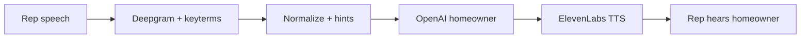

# Rep–AI interaction: accurate transcription and better AI audio

## Scope: refine, don’t reinvent

The voice drill stack is **already built**: Deepgram streaming, transcript normalization, orchestrator-driven prompts, OpenAI (or Anthropic) streaming, micro-behavior, ElevenLabs TTS, and WebSocket events in [`ws.py`](../../backend/app/voice/ws.py). This document is **not** a backlog of new features—it is a guide to **optimization and tuning** on top of that baseline.

Expect work to look like: **better data** (vocabulary hints, correction tables), **parameter and threshold tuning** (endpointing, confidence gates, temperature, voice settings), **tighter copy in existing prompt templates**, **logging and measurement**, and **A/B comparison** of settings—not new subsystems or protocols unless something proves inadequate after measurement.

**Out of scope here:** greenfield features (new drill modes, new providers, large UI surfaces), unless a spike is explicitly justified by production evidence.

---

This roadmap narrows in on **what the homeowner “hears”** (STT quality) and **how the homeowner sounds and speaks** (OpenAI text + ElevenLabs voice). Garbage-in from STT drives nonsensical LLM replies; weak prompts or TTS settings make good text feel flat or robotic.

**Pipeline (where quality is won or lost):** mic → Deepgram → [`TranscriptNormalizationService`](../../backend/app/services/transcript_normalization_service.py) → [`ConversationOrchestrator`](../../backend/app/services/conversation_orchestrator.py) → [`OpenAiLlmClient.stream_reply`](../../backend/app/services/provider_clients.py) → micro-behavior → [`ElevenLabsTtsClient.stream_audio`](../../backend/app/services/provider_clients.py) → mobile player ([`backend/app/voice/ws.py`](../../backend/app/voice/ws.py)).

---

## Tracking

*(Each item assumes the underlying hook already exists; the work is measurement, data, or tuning.)*

### Transcription accuracy

- [ ] **Measure** existing `deepgram_utterance_result` logs (raw vs final text, confidence); sample failures where rep intent ≠ transcript
- [ ] **Enrich** `keyword_hints` content feeding Deepgram `keyterm`—same pipeline as today ([`_current_vocabulary_hints`](../../backend/app/voice/ws.py) → `transcript_normalizer.keyword_hints`)
- [ ] **Tune** `endpointing_ms` / `utterance_end_ms` and VAD debounce for **fewer clipped endings** vs **premature finalize** ([`_stt_turn_tuning`](../../backend/app/voice/ws.py), [`_listen_url`](../../backend/app/services/provider_clients.py))
- [ ] **Revisit** `LOW_CONFIDENCE_THRESHOLD` and short-transcript rules in [`ws.py`](../../backend/app/voice/ws.py) so bad STT triggers clarification instead of wrong homeowner replies
- [ ] **Extend** `PHONETIC_CORRECTION_TABLE` and domain lists from real mishears (pest brands, plan names, local place names)

### OpenAI (homeowner replies)

- [ ] **Sharpen** existing system / template layers: ground turns in the **literal rep transcript**; if ambiguous, ask a short clarifying question (reduces “mouse vs house” derailment)
- [ ] **A/B** `temperature` and `max_tokens` (`homeowner_token_budget`) for coherence vs variety ([`OpenAiLlmClient`](../../backend/app/services/provider_clients.py), orchestrator)
- [ ] **Tighten** prompt layers so replies consistently reference **active objections and stage** ([`conversation_orchestrator.py`](backend/app/services/conversation_orchestrator.py))
- [ ] When `LLM_PROVIDER=openai`, **benchmark** `OPENAI_MODEL` for instruction-following vs cost (bad-turn rate on fixed eval transcripts)

### ElevenLabs (how the homeowner sounds)

- [ ] **Compare** env-selected `ELEVENLABS_MODEL_ID` (e.g. `eleven_flash_v2_5` vs higher-fidelity) for prosody; document latency vs quality ([`config.py`](../../backend/app/core/config.py))
- [ ] **Adjust** hardcoded `voice_settings.stability` / `similarity_boost` in [`ElevenLabsTtsClient`](../../backend/app/services/provider_clients.py)—optionally map from emotion later; first pass can be global constants only
- [ ] **Refine** micro-behavior **segment length and pauses** for speakability ([`micro_behavior_engine.py`](../../backend/app/services/micro_behavior_engine.py))

---

## 1. Transcribe the rep accurately (Deepgram + preprocessing)

### 1.1 Deepgram request shape (already in code)

[`DeepgramSttClient._listen_url`](../../backend/app/services/provider_clients.py) sets `model`, `smart_format`, `punctuate`, `interim_results`, `endpointing`, `utterance_end_ms`, `language`, `no_delay`, and optional repeated **`keyterm`** from `vocabulary_hints` (Nova 3).

**Accuracy levers:**

- **`keyterm` / vocabulary hints** — You already pass scenario-, org-, and objection-derived hints from [`_current_vocabulary_hints`](../../backend/app/voice/ws.py). Prioritize: competitor names, product names, local geography, objection phrases. Cap is 100 terms; rank by frequency and session relevance.
- **Endpointing vs truncation** — Aggressive VAD/finalize improves latency but can **cut off final words**. Tune `endpointing_ms`, `utterance_end_ms`, and VAD debounce together; measure WER or human spot-checks, not latency alone.
- **Audio upstream** — Wrong `encoding` / `sample_rate` / `mimetype` pairing historically caused empty or poor transcripts ([`PRODUCTION_CHECKLIST.md`](../ops/PRODUCTION_CHECKLIST.md)). Keep client metadata honest and consistent with [`_normalized_audio_params`](../../backend/app/services/provider_clients.py).

### 1.2 After Deepgram: normalization and gating

[`TranscriptNormalizationService`](../../backend/app/services/transcript_normalization_service.py) applies domain terms, phonetic fixes, and fuzzy corrections. That is often **cheaper than fighting the ASR** for recurring pest-industry mishears.

[`ws.py`](../../backend/app/voice/ws.py) can block low-confidence or too-short transcripts and play clarification lines instead of sending garbage to the LLM. Tuning thresholds is a direct accuracy lever: too strict → annoying “say again”; too loose → homeowner responds to nonsense.

### 1.3 Optional deeper passes (only if measurement demands it)

Refinement-first: exhaust **hints, normalization, and gating** before new pipelines. Backend config includes Whisper-related settings (`WHISPER_*`); a **second-pass** or replay-only cleanup is a **larger feature** than tuning—only pursue if logs show a class of errors that hints and normalization cannot fix.

### 1.4 Diagnostics

**Standardize and use** logging described in [`CODEX_PROMPT_STT_FLOW.md`](../../CODEX_PROMPT_STT_FLOW.md): correlate **raw Deepgram output**, **post-normalization text**, and **LLM reply** for failed drills (extend what exists rather than designing a new observability stack).

---

## 2. Better homeowner *text* from OpenAI

The homeowner only “knows” what the rep said through the **transcript string** passed into `stream_reply`. Accuracy work in §1 pays off here.

**Prompting (edit what you already ship):**

- Strengthen wording in **existing** orchestrator / Jinja / DB-backed prompt paths so the model **grounds every turn in the latest user message** and **asks a short clarification** when the transcript is vague or ungrammatical (common right after bad STT).
- **Tighten** use of **emotion, stage, and active objections** already passed into the system prompt ([`conversation_orchestrator.py`](../../backend/app/services/conversation_orchestrator.py)) so replies stay consistent and challenging, not generic chatbot filler.

**API parameters** (already wired in [`OpenAiLlmClient`](../../backend/app/services/provider_clients.py); adjust values and redeploy):

- **`temperature`** (currently `0.4`) — lower for more predictable objection handling; slightly higher for varied personas if rubric allows.
- **`max_tokens`** — tied to `homeowner_token_budget(stage)`; too low causes clipped answers; too high encourages rambling that sounds unnatural when spoken.

**Model choice:** Stronger models usually follow multi-constraint prompts (persona + stage + objection stack) more reliably; validate with fixed transcripts and blind manager ratings.

---

## 3. Better homeowner *audio* from ElevenLabs

TTS quality depends on **input text** (micro-behavior output), **voice ID**, **model_id**, and **voice_settings**.

[`ElevenLabsTtsClient`](../../backend/app/services/provider_clients.py) today uses:

- `model_id` from env (default `eleven_flash_v2_5` — latency-first),
- `optimize_streaming_latency: 3`,
- `voice_settings`: `stability` / `similarity_boost` fixed at `0.5` / `0.75`.

**Directions (mostly constants and content):**

- **Model** — Change `ELEVENLABS_MODEL_ID` in config and compare; same client code path.
- **Voice settings** — Higher stability can sound flatter; lower can drift. First optimization: **single best pair** of `stability` / `similarity_boost` in [`ElevenLabsTtsClient`](../../backend/app/services/provider_clients.py). Per-persona or emotion mapping is a **later** refinement if needed.
- **Text fed to ElevenLabs** — Micro-behavior already splits text and inserts pauses; **tune rules** so segments read as speech, not bullet points.

---

## 4. Suggested sequencing

Each phase is **iterative tuning** on the current architecture—not a milestone that unlocks a new capability.

| Phase | Focus | Why |
| ----- | ----- | --- |
| A | Logging: STT raw + normalized + confidence + final LLM input | Pinpoint whether errors are ASR, normalization, or model |
| B | Vocabulary hints + normalization tables from real sessions | High ROI using existing `keyterm` + normalizer hooks |
| C | Confidence / length gating + clarification copy | Adjust existing gates in `ws.py` |
| D | Prompt copy + temperature / token budget | Better answers without new APIs |
| E | ElevenLabs model env + voice_settings constants + micro-behavior rules | Better audio from same `stream_audio` path |

---

## Related docs

- [PRD_latency_optimization.md](./PRD_latency_optimization.md) — VAD-triggered finalization (latency; also interacts with **cutoff** risk)
- [EMOTION_SIMULATION_ENGINE.md](./EMOTION_SIMULATION_ENGINE.md) — What the orchestrator tells the LLM each turn
- [CODEX_PROMPT_STT_FLOW.md](../../CODEX_PROMPT_STT_FLOW.md) — Deepgram finalize / `speech_final` behavior and logging ideas
