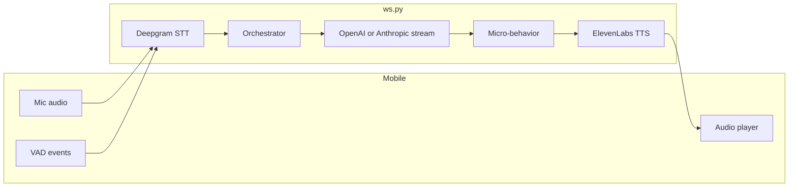

# Rep–AI interaction: speed, realism, and training

Roadmap for improving the sales rep’s live drill experience (latency, realism, and training outcomes). Aligned with the current voice pipeline and existing PRDs.

## Tracking

- [ ] Add/verify structured logs for STT finalize → LLM first token → first TTS byte (reuse `TurnLatencyRecord` in `ws.py`)
- [ ] Spike mobile audio player + protocol changes for incremental playback vs full-segment MP3
- [ ] Restructure system prompt into stable vs per-turn blocks; enable provider prompt caching if applicable
- [ ] Tune Deepgram endpointing / `utterance_end_ms` and confidence gates with production traces
- [ ] Audit `grading_service` labels vs orchestrator objection/stage vocabulary for coaching consistency

---

## What you are building (code-grounded)

- **Product**: Live voice practice for door-to-door reps (Expo app) + manager dashboard; scenarios and rubrics under [`scenarios/`](../../scenarios/).
- **Hot path**: `client.audio.chunk` / `client.vad.state` → Deepgram → transcript normalization → [`ConversationOrchestrator.prepare_rep_turn`](../../backend/app/services/conversation_orchestrator.py) → `providers.llm.stream_reply` → sentence split + [`ConversationalMicroBehaviorEngine`](../../backend/app/services/micro_behavior_engine.py) → `providers.tts.stream_audio` → `server.ai.audio.chunk` ([`backend/app/voice/ws.py`](../../backend/app/voice/ws.py)).
- **Training loop**: Post-session grading and scorecards via [`grading_service.py`](../../backend/app/services/grading_service.py) (separate non-streaming LLM call); emotion/objection state machine documented in [EMOTION_SIMULATION_ENGINE.md](./EMOTION_SIMULATION_ENGINE.md).
- **Prompt system**: Jinja templates in [`backend/app/prompt_templates/`](../../backend/app/prompt_templates/), DB-backed versions via [`prompt_version_resolver.py`](../../backend/app/services/prompt_version_resolver.py) / admin APIs; orchestrator already defines soft/hard token limits (`SYSTEM_PROMPT_SOFT_LIMIT_TOKENS` / `HARD` in [`conversation_orchestrator.py`](../../backend/app/services/conversation_orchestrator.py)).

---

## Latency (biggest wins first)

1. **TTS “streaming” vs first audible byte (critical)**  
   In [`stream_tts_for_plan`](../../backend/app/voice/ws.py) the server **accumulates the full ElevenLabs MP3 for each segment** before emitting one `server.ai.audio.chunk`, because Expo AV needs a complete file. That means **time-to-first-audio includes entire segment synthesis**, not just first network bytes from ElevenLabs.  
   **Directions**: (a) **Mobile**: switch to a player path that accepts **incremental PCM or chunked MP3** (e.g. native streaming, or smaller semantic units than full micro-behavior segments); (b) **Server**: if the player supports it, emit partial chunks as they arrive instead of buffering; (c) **Content**: shorten first sentence via prompt + micro-behavior so the **first TTS job is physically shorter**.

2. **LLM time-to-first-token**  
   - **Model routing**: You already support OpenAI and Anthropic in [`provider_clients.py`](../../backend/app/services/provider_clients.py); measure TTFT vs quality and consider a **faster model for early turns** or easy scenarios.  
   - **Prompt size**: Orchestrator builds a rich system prompt; enforce/monitor the existing soft/hard caps and trim redundant layers per stage.  
   - **Provider features**: Use **prompt caching** where the static portion of the system prompt is stable (OpenAI/Anthropic both support patterns that reward large stable prefixes)—structure `build()` output so **org + scenario + persona** are stable blocks and **emotion/objection state** is a small tail that changes each turn.

3. **Sentence-boundary pipeline**  
   TTS only starts after `[.?!]` + micro-behavior transform. **Very short first replies** in the system prompt (“Lead with ≤8 words, then continue”) reduce wait for the first sentence boundary. Optional: **clause-level or comma flush** for the *first* sentence only (tune carefully for natural speech).

4. **Deepgram**  
   - [PRD_latency_optimization.md](./PRD_latency_optimization.md) Task 1 (VAD + `trigger_finalization`) is **already present** in `ws.py` / `DeepgramSttClient`.  
   - Remaining STT knobs: **endpointing / utterance_end_ms**, model choice (`DEEPGRAM_MODEL`, default `nova-3` in [`config.py`](../../backend/app/core/config.py)), and **confidence gating** (you already have `transcript_blocked_low_confidence` paths in `ws.py`)—tune thresholds using logged `deepgram_utterance_result` style telemetry from [`CODEX_PROMPT_STT_FLOW.md`](../../CODEX_PROMPT_STT_FLOW.md).

5. **ElevenLabs**  
   - Default `eleven_flash_v2_5` is already latency-oriented ([`config.py`](../../backend/app/core/config.py)).  
   - **Voice consistency vs speed**: fewer voice switches; avoid long `[[voice:...]]` prefixes if they affect caching.  
   - **Parallelism**: Multiple sentences spawn multiple TTS tasks but **`tts_emit_lock` serializes playback-related emission**—correct for audio order; just know **parallel HTTP streams may not shorten perceived latency** for turn 1.

6. **Post-turn / DB work**  
   Defer non-critical persistence off the critical path (remaining items in [PRD_latency_optimization.md](./PRD_latency_optimization.md): deferred commit, adaptive flush) so **STT final → LLM call** is unblocked.

7. **Long-term architecture**  
   [architecture.md](./architecture.md) mentions **OpenAI Realtime API** as an all-in-one voice stack. Worth a spike if you want **single-hop voice** and are willing to rework the client and state machine.

---

## Realism (prompt + runtime behavior)

1. **Orchestrator is the main “director”**  
   Emotion, objection queues, stage progression, and behavioral signals already feed the LLM. Improvements: **tighter stage-specific rubrics** in prompts (“at `door_knock` never agree to an appointment”), **persona dialect / verbal tics** as short stable blocks, and **explicit anti-patterns** (“don’t sound like a customer service script”).

2. **Micro-behavior + TTS alignment**  
   Pauses and segmentation from [`micro_behavior_engine.py`](../../backend/app/services/micro_behavior_engine.py) should match **what ElevenLabs sounds natural saying**—if segments get too chopped, audio feels robotic; if too long, latency hurts. **Tune segment rules per emotion** using replay + manager feedback.

3. **Barge-in realism**  
   [`set_interrupt`](../../backend/app/voice/ws.py) cancels TTS tasks; validate on device that **client buffer flush** matches PRD notes in [PRD_latency_optimization.md](./PRD_latency_optimization.md) (no 200–500 ms ghost audio).

4. **Grounding in org materials**  
   RAG chunks at session bind ([`document_retrieval_service.py`](../../backend/app/services/document_retrieval_service.py)) reduce “generic homeowner” answers; expand **retrieve_for_topic** coverage for common objections in each vertical.

---

## Training effectiveness (beyond the live call)

1. **Grading prompt + rubric alignment**  
   Ensure [`grading_service.py`](../../backend/app/services/grading_service.py) categories match what the **live homeowner** was trying to teach (same objection labels, same stage names). Mismatch confuses reps.

2. **Use logged signals for coaching**  
   You already emit **homeowner state** and **micro_behavior** metadata on WebSocket events—surface these in **replay UI** so reps see *why* emotion shifted, not only transcript.

3. **Optional live assist (scope expansion)**  
   Lightweight “coach hints” (post-turn or on manager delay) are a separate product slice; core realism should stay in the **homeowner** model, not spoken over the drill.

---

## Suggested sequencing

| Phase | Focus | Rationale |
| ----- | ----- | --------- |
| A | Instrument TTFT, first MP3 byte, STT finalize lag | Confirms whether TTS buffering or LLM dominates |
| B | Client audio path for true streaming OR shorter first utterance | Largest perceived latency lever if logs show TTS dominates |
| C | Prompt caching + token budget enforcement | Cheap recurring win on LLM latency/cost |
| D | Deepgram endpointing + confidence tuning | Polish STT end-to-LLM handoff |
| E | Grading/orchestrator label alignment | Improves learning loop quality |
